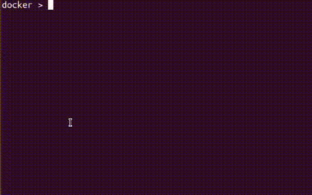

<div id="top"></div>

<!-- PROJECT SHIELDS -->
<!--
*** I'm using markdown "reference style" links for readability.
*** Reference links are enclosed in brackets [ ] instead of parentheses ( ).
*** See the bottom of this document for the declaration of the reference variables
*** for contributors-url, forks-url, etc. This is an optional, concise syntax you may use.
*** https://www.markdownguide.org/basic-syntax/#reference-style-links
-->
[![Contributors][contributors-shield]][contributors-url]
[![Forks][forks-shield]][forks-url]
[![Stargazers][stars-shield]][stars-url]
[![Issues][issues-shield]][issues-url]
[![GPLv3 License][license-shield]][license-url]
[![Last Commit][last-commit-shield]][last-commit-url]


<!-- PROJECT LOGO -->
<br />
<div align="center">
  <a href="https://github.com/solamarpreet/dockersh">
    
  </a>
<h2 align="center">DockerSh</h2>

  <p align="center">
    <i>A shell for Docker commands with autocompletion and history</i>
    <br />
  </p>
</div>
<br />

<p align="center">
  
</p>

<!-- TABLE OF CONTENTS -->
<details>
  <summary>Table of Contents</summary>
  <ol>
    <li><a href="#prerequisites">Installation</a></li>
    <li><a href="#usage">Usage</a></li>
    <li><a href="#troubleshooting">Troubleshooting</a></li>
    <li><a href="#roadmap">Roadmap</a></li>
    <li><a href="#contributing">Contributing</a></li>
    <li><a href="#license">License</a></li>
    <li><a href="#contact">Contact</a></li>
    <li><a href="#acknowledgments">Acknowledgments</a></li>
  </ol>
</details>
<br />


<!-- GETTING STARTED -->
## Getting Started

### Prerequisites

The following external dependencies need to be satisfied in order to run DockerSh.
* Python 3.8 +
<br />

### Installation via PyPI for non-rootless Docker

1. Install pipx to safely run DockerSh from anywhere in the terminal
   ```sh
   sudo pip install pipx
   ```
   ```sh
   sudo pipx ensurepath
   ```
2. Pull DockerSh from PyPI
   ```sh
   sudo pipx install dockersh
   ```
3. Start DockerSh
   ```sh
   sudo dockersh
   ```

<br />

### Installation via PyPI for rootless Docker

1. Install pipx to safely run DockerSh from anywhere in the terminal
   ```sh
   python3 -m pip install --user pipx
   ```
   ```sh
   python3 -m pipx ensurepath
   ```
2. Pull DockerSh from PyPI
   ```sh
   pipx install dockersh
   ```
3. Start DockerSh
   ```sh
   dockersh
   ```

<br />

### Installation via GitHub

1. Clone the repo and cd into the folder
   ```sh
   git clone https://github.com/solamarpreet/dockersh.git && cd dockersh
   ```
2. Install requirements
   ```sh
   python3 -m pip install -r requirements.txt
   ```
3. Start DockerSh
   ```sh
   sudo python3 dockersh.py
   ```
    > or if Docker is configured to work in rootless mode
    >
    >```terminal
    >python3 dockersh.py
    >```
<br />

## Usage

Within DockerSh you dont need to prepend docker to any command. Simply type your command of choice like
   ```terminal
   docker > ps
   ```
<br />
<p align="right">(<a href="#top">back to top</a>)</p>


<!-- TROUBLESHOOTING -->
## Troubleshooting

DockerSh will fail to start if sudo is not supplied and your Docker Engine isn't configured to run in rootless mode. In that case you can start dockersh with sudo or configure Docker to run in rootless mode as specified [here](https://docs.docker.com/engine/security/rootless/).

In case of any other problem check the [open issues](https://github.com/solamarpreet/dockersh/issues) for a list known issues and open a new issue.

<br />

<!-- ROADMAP -->
## Roadmap

- [ ] Syntax highlighting
- [ ] Integrating help with autocomplete


<br />

<!-- CONTRIBUTING -->
## Contributing

Please create pull requests in the `dev` branch. You can also give your ideas by opening a new issue and describing the features you would like to see added.

<br />

<!-- LICENSE -->
## License

Distributed under the MIT License. See `LICENSE` for more information.

<br />

<!-- CONTACT -->
## Contact

Amarpreet Singh - solamarpreet@protonmail.com

Blog & Portfolio : [https://solamarpreet.github.io](https://solamarpreet.github.io)

<br />

<!-- ACKNOWLEDGMENTS -->
## Acknowledgments

* [Amjith Ramanujam](https://github.com/amjith)
* [Python Prompt Toolkit](https://github.com/prompt-toolkit/python-prompt-toolkit)
* [Python Discord](https://www.pythondiscord.com)
* [Flaticon](https://www.flaticon.com)

<br />
<p align="right">(<a href="#top">back to top</a>)</p>


<!-- MARKDOWN LINKS & IMAGES -->
<!-- https://www.markdownguide.org/basic-syntax/#reference-style-links -->
[contributors-shield]: https://img.shields.io/github/contributors/solamarpreet/dockersh.svg?style=for-the-badge
[contributors-url]: https://github.com/solamarpreet/dockersh/graphs/contributors
[forks-shield]: https://img.shields.io/github/forks/solamarpreet/dockersh.svg?style=for-the-badge
[forks-url]: https://github.com/solamarpreet/dockersh/network/members
[stars-shield]: https://img.shields.io/github/stars/solamarpreet/dockersh.svg?style=for-the-badge
[stars-url]: https://github.com/solamarpreet/dockersh/stargazers
[issues-shield]: https://img.shields.io/github/issues/solamarpreet/dockersh.svg?style=for-the-badge
[issues-url]: https://github.com/solamarpreet/dockersh/issues
[license-shield]: https://img.shields.io/github/license/solamarpreet/dockersh.svg?style=for-the-badge
[license-url]: https://github.com/solamarpreet/dockersh/blob/main/LICENSE
[last-commit-shield]: https://img.shields.io/github/last-commit/solamarpreet/dockersh?style=for-the-badge
[last-commit-url]: https://github.com/solamarpreet/dockersh/pulse
